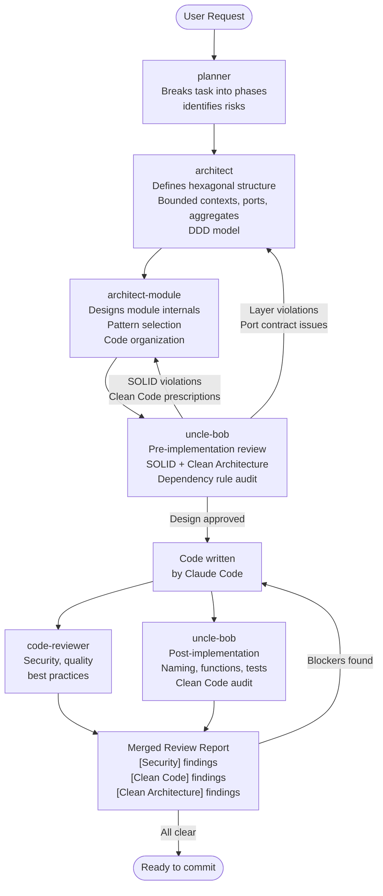
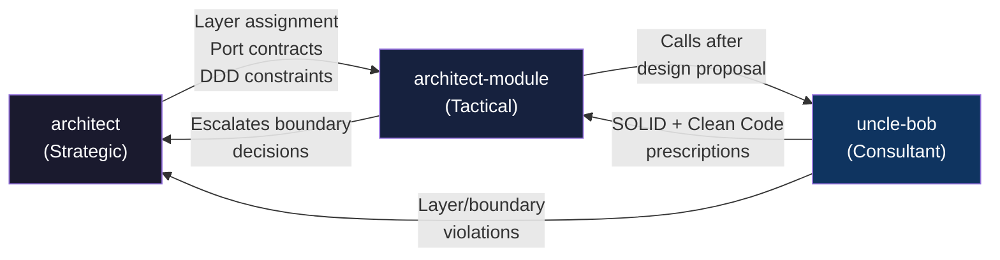

# Agent Orchestration

## Full Development Flow

## Architecture Agent Chain

## Responsibilities Split

| Agent | Scope | Enforces |
|---|---|---|
| **architect** | System-wide | Hexagonal Architecture, DDD strategic (bounded contexts, aggregates, ports) |
| **architect-module** | Single layer/module | Module internals, pattern selection, code efficiency |
| **uncle-bob** | Design + code | SOLID, Clean Architecture dependency rule, Clean Code (naming, functions, tests) |
| **planner** | Feature scope | Implementation phases, risk assessment |
| **code-reviewer** | Changed code | Security, quality, regressions |
