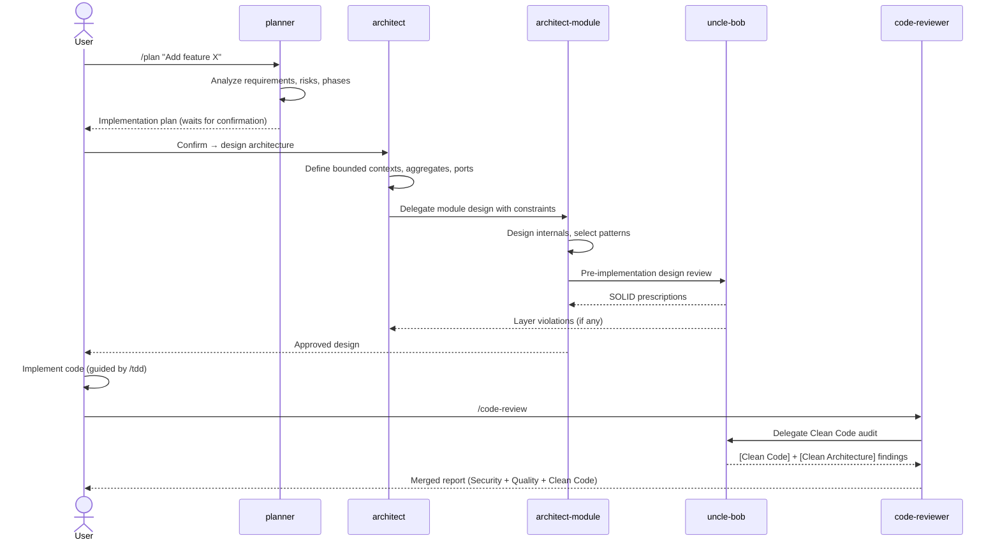

# Feature Development — Full Lifecycle

```mermaid
sequenceDiagram
    actor User
    participant planner
    participant architect
    participant architect-module
    participant uncle-bob
    participant code-reviewer

    User->>planner: /plan "Add feature X"
    planner->>planner: Analyze requirements, risks, phases
    planner-->>User: Implementation plan (waits for confirmation)

    User->>architect: Confirm → design architecture
    architect->>architect: Define bounded contexts, aggregates, ports
    architect->>architect-module: Delegate module design with constraints

    architect-module->>architect-module: Design internals, select patterns
    architect-module->>uncle-bob: Pre-implementation design review
    uncle-bob-->>architect-module: SOLID prescriptions
    uncle-bob-->>architect: Layer violations (if any)

    architect-module-->>User: Approved design

    User->>User: Implement code (guided by /tdd)

    User->>code-reviewer: /code-review
    code-reviewer->>uncle-bob: Delegate Clean Code audit
    uncle-bob-->>code-reviewer: [Clean Code] + [Clean Architecture] findings
    code-reviewer-->>User: Merged report (Security + Quality + Clean Code)
```
