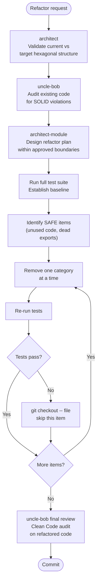

# Refactoring Flow

```mermaid
flowchart TD
    START(["Refactor request"]) --> ARCH["architect\nValidate current vs\ntarget hexagonal structure"]

    ARCH --> UB["uncle-bob\nAudit existing code\nfor SOLID violations"]

    UB --> PLAN["architect-module\nDesign refactor plan\nwithin approved boundaries"]

    PLAN --> TESTS["Run full test suite\nEstablish baseline"]

    TESTS --> SAFE["Identify SAFE items\n(unused code, dead exports)"]
    SAFE --> DELETE["Remove one category\nat a time"]
    DELETE --> VERIFY["Re-run tests"]

    VERIFY --> PASS{Tests pass?}
    PASS -->|No| REVERT["git checkout -- file\nskip this item"]
    PASS -->|Yes| MORE{More items?}

    MORE -->|Yes| DELETE
    MORE -->|No| UB2["uncle-bob final review\nClean Code audit\non refactored code"]

    UB2 --> COMMIT(["Commit"])
    REVERT --> MORE
```
