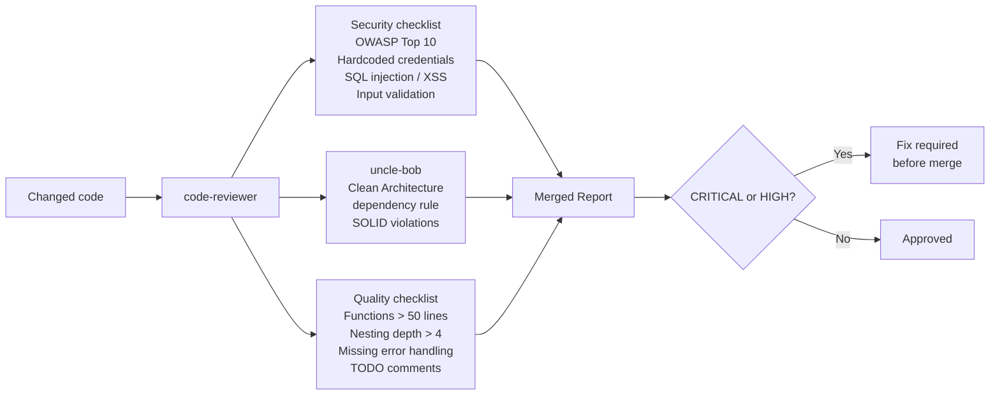

# Security Review Flow

```mermaid
flowchart LR
    CODE["Changed code"] --> CR["code-reviewer"]

    CR --> SEC["Security checklist\nOWASP Top 10\nHardcoded credentials\nSQL injection / XSS\nInput validation"]

    CR --> UB["uncle-bob\nClean Architecture\ndependency rule\nSOLID violations"]

    CR --> QUAL["Quality checklist\nFunctions > 50 lines\nNesting depth > 4\nMissing error handling\nTODO comments"]

    SEC --> MERGE["Merged Report"]
    UB --> MERGE
    QUAL --> MERGE

    MERGE --> BLOCK{CRITICAL or HIGH?}
    BLOCK -->|Yes| FIX["Fix required\nbefore merge"]
    BLOCK -->|No| APPROVE["Approved"]
```
