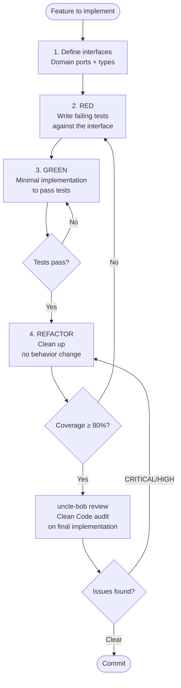

# TDD Workflow

```mermaid
flowchart TD
    START(["Feature to implement"]) --> INTERFACE["1. Define interfaces\nDomain ports + types"]

    INTERFACE --> RED["2. RED\nWrite failing tests\nagainst the interface"]

    RED --> GREEN["3. GREEN\nMinimal implementation\nto pass tests"]

    GREEN --> CHECK{Tests pass?}
    CHECK -->|No| GREEN
    CHECK -->|Yes| REFACTOR["4. REFACTOR\nClean up\nno behavior change"]

    REFACTOR --> COVERAGE{Coverage ≥ 80%?}
    COVERAGE -->|No| RED
    COVERAGE -->|Yes| UB["uncle-bob review\nClean Code audit\non final implementation"]

    UB --> ISSUES{Issues found?}
    ISSUES -->|CRITICAL/HIGH| REFACTOR
    ISSUES -->|Clear| DONE(["Commit"])
```
