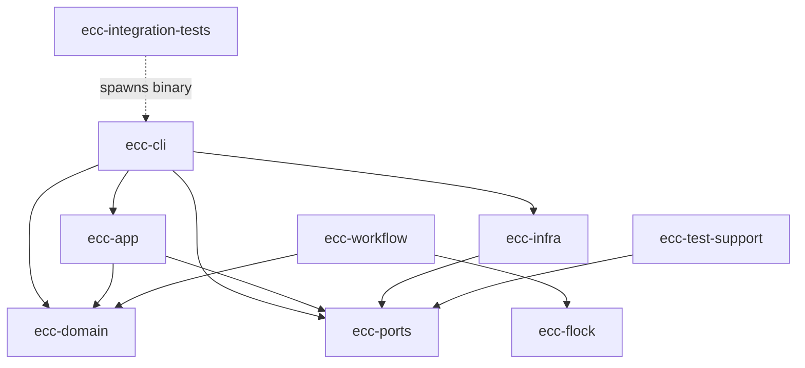

# Dependency Graph

Cargo workspace crate dependency relationships.

## Crate Dependencies

## Dependency Direction (strict)

| Crate | Depends On | Depended On By |
|-------|-----------|----------------|
| ecc-domain | — | ecc-app, ecc-cli, ecc-workflow |
| ecc-ports | — | ecc-app, ecc-cli, ecc-infra, ecc-test-support |
| ecc-infra | ecc-ports | ecc-cli |
| ecc-app | ecc-domain, ecc-ports | ecc-cli |
| ecc-cli | ecc-app, ecc-infra, ecc-domain, ecc-ports | — |
| ecc-workflow | ecc-domain, ecc-flock | — |
| ecc-flock | — | ecc-workflow |
| ecc-test-support | ecc-ports | ecc-app (dev-dep) |
| ecc-integration-tests | — (spawns binary) | — |

## Stability Metrics

| Crate | I (instability) | Role |
|-------|----------------|------|
| ecc-domain | 0.00 | Maximally stable (pure logic) |
| ecc-ports | 0.00 | Maximally stable (trait definitions) |
| ecc-infra | 0.50 | Balanced (adapters) |
| ecc-app | 0.67 | Moderately unstable (orchestration) |
| ecc-cli | 1.00 | Maximally unstable (entry point) |
| ecc-workflow | 1.00 | Maximally unstable (standalone binary) |
