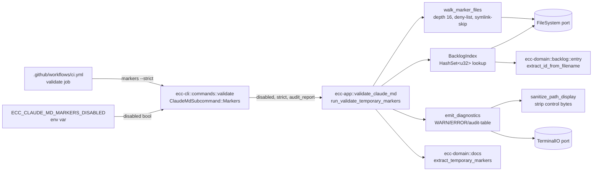

# CLAUDE.md TEMPORARY Marker Lint Element

**Type**: Validation Subsystem
**Category**: Doc Drift Prevention
**Layer**: CLI → App → Domain (hexagonal)

## Overview

The `ecc validate claude-md markers` subcommand scans every `CLAUDE.md` and `AGENTS.md` under the project root for `TEMPORARY (BL-NNN)` warning comments, and flags any whose backing backlog file (`docs/backlog/BL-NNN-*.md`) is missing on disk. Default severity is WARN (exit 0); `--strict` upgrades to ERROR (exit 1) for CI gates.

Motivation: warning comments that reference backlog IDs tend to rot — either because the underlying work ships and the comment isn't removed, or because the ID was reserved but never filed. The lint rule closes both drift classes. The v1 uses presence-only semantics (file on disk = resolved); BL-158 tracks a frontmatter-aware v2 that closes the archived=resolved governance loophole.

## Component Diagram

## Data Flow

1. **Entry**: CI or user runs `ecc validate claude-md markers [--strict] [--audit-report]`. CLI reads `ECC_CLAUDE_MD_MARKERS_DISABLED` from env; if `1`, emits stderr notice and exits 0 (emergency brake).
2. **Walk**: `walk_marker_files` recursively visits the project root via `FileSystem::read_dir`. Skips `.git/`, `target/`, `node_modules/`, `.claude/worktrees/`. Skips symlinks via `FileSystem::is_symlink`. Depth capped at 16 (WARN emitted beyond). Collects `CLAUDE.md` and `AGENTS.md` files; sorts lexicographically.
3. **Index**: `BacklogIndex::load` reads `docs/backlog/` once via `FileSystem::read_dir`, parses each filename through `extract_id_from_filename` into a `HashSet<u32>`. Lookup is O(1) thereafter.
4. **Extract**: For each marker file, `ecc_domain::docs::claude_md::extract_temporary_markers` parses line-by-line (fence-skipping) with regex `(?i)TEMPORARY\s*\(BL-0*(\d{1,6})\)` producing `Vec<TemporaryMarker>`.
5. **Resolve**: Each marker's `backlog_id` is checked against the index. Missing → finding.
6. **Emit**: `emit_diagnostics` routes findings to stderr (WARN/ERROR prefix based on `strict`) or stdout (markdown table if `audit_report`). All paths pass through `sanitize_path_display` first.

## Architecture Compliance

- **Domain purity**: `ecc-domain::docs::claude_md` and `ecc-domain::backlog::entry` use zero I/O imports (PC-038 grep-guarded).
- **Trait-based ports**: app layer depends only on `FileSystem` + `TerminalIO`; no concrete adapter imports.
- **ACL boundary**: `TemporaryMarker` holds `backlog_id: u32` primitive, not a `BacklogId` VO — `docs` and `backlog` contexts communicate via primitive ID translation.
- **SRP**: top-level `run_validate_temporary_markers` function stays <50 LOC by delegating to 5 helpers (walker, index, extraction, emission, sanitizer).

## Key Design Decisions (from spec)

- **Subcommand not flag-stacking** (decision #1): `ecc validate claude-md markers` instead of `--markers` flag extending `ClaudeMd`.
- **WARN by default** (decision #2): `--strict` opt-in for CI. Safer day-1 adoption.
- **CLAUDE.md + AGENTS.md v1** (decision #3): forward-compat with ADR 0062.
- **Presence-only** (decision #4): archived files count as resolved; BL-158 tracks v2 upgrade.
- **Hand-rolled fence-skip** (decision #5): mirror sibling `extract_claims`; no new deps.
- **Atomic BL-150 fix** (decision #6): CLAUDE.md:108 removal included in this spec's commit trail.
- **CI --strict day 1** (decision #7): green on first run because of BL-150 removal (commit SHA `9e60f30d`).
- **Kill switch** (decision #13): `ECC_CLAUDE_MD_MARKERS_DISABLED=1` — emergency rollback without a code revert.

## E2E Boundaries

| Boundary | Test |
|----------|------|
| CLI → app | `markers_strict_happy_and_fail_message_composition` |
| Subprocess env | `kill_switch_env_subprocess` |
| Clap parsing | `strict_scoped_to_markers`, `clap_surface_smoke`, `counts_flag_deprecation_warning` |
| Real-repo audit | `./target/release/ecc validate claude-md markers --strict` post-BL-150-removal → exit 0 |

## Cross-References

- Spec: `docs/specs/2026-04-18-claude-md-temp-marker-lint/spec.md`
- Design: `docs/specs/2026-04-18-claude-md-temp-marker-lint/design.md`
- Audit artifact: `docs/specs/2026-04-18-claude-md-temp-marker-lint/audit-report.md`
- v2 follow-up: `docs/backlog/BL-158-frontmatter-aware-temporary-marker-v2.md`
- CI: `.github/workflows/ci.yml` validate job (atomic step per AC-006.4; revertable as single commit).
