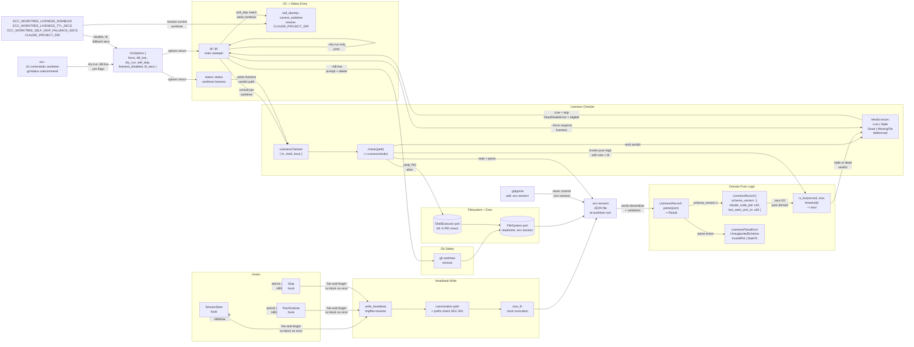

# Safe Worktree GC via PID + Heartbeat Element

**Type**: Liveness Subsystem  
**Category**: Worktree Safety  
**Layer**: CLI → App → Domain (hexagonal)

## Overview

The worktree GC liveness subsystem prevents `ecc worktree gc` from deleting live sessions by consulting a hybrid PID + heartbeat mechanism. Every hook invocation (SessionStart, PostToolUse, Stop) writes an atomic `.ecc-session` JSON file containing the Claude Code process ID and last-seen timestamp. Before deleting any worktree, GC consults `LivenessChecker` which verifies both the PID aliveness (via `kill -0`) and heartbeat freshness (mtime < 60-min TTL). The system includes self-skip logic to prevent GC from deleting the worktree it's currently running in, plus a conservative fallback that skips all session worktrees <60 min old if the self-identity resolver fails.

## Component Diagram

## Data Flow

1. **Heartbeat Write**: Each hook (SessionStart, PostToolUse, Stop) calls `write_heartbeat(fs, worktree_path, pid, now_fn)` asynchronously (fire-and-forget). The function canonicalizes the target path and checks for symlink escape (SEC-001), then invokes `now_fn()` to get the current Unix timestamp (SEC-001 timing: invoked AFTER canonicalize to prevent TOCTOU attacks). The JSON record `{schema_version: 1, claude_code_pid: parent_pid, last_seen_unix_ts: now}` is written atomically via tmpfile+rename to `.ecc-session` at the worktree root. Write failures emit `tracing::warn!` with structured fields but do NOT block hook execution.

2. **GC Entry**: When `ecc worktree gc` runs (manually or auto-triggered by SessionStart), it receives `GcOptions` from the CLI, which includes `self_skip: Option<WorktreeName>` resolved by `current_worktree()`. The GC function iterates worktrees, skipping the self-worktree via early-continue if the resolver succeeded; if resolver returns `None`, it conservatively skips all `ecc-session-*`-prefixed worktrees younger than 60 min (fallback window per AC-003.3). For each non-skipped worktree, it invokes `LivenessChecker::check(path) -> LivenessVerdict`.

3. **Liveness Check**: `LivenessChecker::check` first attempts to read and deserialize `.ecc-session` from the worktree. On parse success, it passes the `LivenessRecord` to the pure-domain `is_live(record, now, ttl_secs)` function alongside the current timestamp and configured TTL (default 60 min, configurable via `ECC_WORKTREE_LIVENESS_TTL_SECS`). If `is_live` returns true, the checker also verifies the PID is still alive via `kill -0`. A Live verdict skips deletion; Dead/Stale/MissingFile/Malformed verdicts mark the worktree as eligible for deletion (AC-001.4 backward-compatible fallback: missing `.ecc-session` delegates to the existing 24-hour stale-timer).

4. **Deletion + Confirmation**: If `--dry-run` is set, GC prints `WOULD DELETE: <name>` for each eligible worktree and exits (zero side effects). Otherwise, `--force` alone respects liveness (skips Live worktrees); `--force --kill-live` requires an interactive confirmation prompt (unless `--yes` suppresses it), which warns the user before deleting live sessions. Non-interactive contexts (no TTY) require `--yes` to proceed with `--kill-live`. All deletions use `git worktree remove` (never `rm -rf`) to avoid `.git` corruption.

5. **Status Consistency**: `ecc worktree status` and `ecc worktree status --json` use the same `LivenessChecker::check` helper, ensuring operator expectations match GC behavior. The `--json` output includes a `liveness_reason` field ("live" | "stale_heartbeat" | "dead_pid" | "missing_session_file" | "malformed") for debugging.

6. **Kill Switch + Bypass**: If `ECC_WORKTREE_LIVENESS_DISABLED=1` is set, the entire new heartbeat path is short-circuited and GC falls back to BL-150 logic (PID parent check + 30-min `.git` recency). The `bypass_mgmt::gc` sweeper also consults the same `LivenessChecker` to avoid deleting bypass tokens whose corresponding worktrees are live.

## Architecture Compliance

- **Domain purity** (PC-025): `ecc-domain::worktree::liveness` has zero I/O imports; `LivenessRecord` and `is_live(record, now, threshold)` are pure functions with no filesystem/process dependencies.
- **Trait-based ports**: App layer depends only on `FileSystem` + `ShellExecutor`; no concrete adapter imports.
- **Single source of truth**: `LivenessChecker::check` is the canonical liveness-verdict dispatcher; both `gc` and `status` consume it (AC-005.1).
- **SRP**: Top-level functions stay <50 LOC by delegating to helpers: `write_heartbeat`, `current_worktree`, `LivenessChecker::check`, `is_live`.
- **Atomic writes**: Heartbeat file is written via tmpfile+rename, preventing torn reads during concurrent PostToolUse writes (AC-002.4).
- **Conservative fallback**: When self-identity resolver fails (returns `None`), GC skips all `ecc-session-*` worktrees <60 min old, preventing accidental fratricide (AC-003.3).
- **Self-skip**: GC early-continues on the worktree it's running in, detected via `CLAUDE_PROJECT_DIR` + `.git` gitdir walking (AC-003.1/.2).

## Key Design Decisions (from spec)

- **Decision #1**: Hybrid PID + heartbeat (reject flock). No long-lived ECC process exists to hold a shared flock for session lifetime. Heartbeat written by every hook invocation is implementable today and loses kernel-guaranteed-on-crash but gains feasibility.
- **Decision #10**: `.ecc-session` file format is serde-serialized JSON with `schema_version: 1` to enable future migration. Atomic write via tmpfile + rename prevents torn reads under concurrent load.
- **Decision #12**: TTL default is **60 min** (revised from 30 min per R1 adversary feedback). Aligns with AC-003.3 self-skip fallback window for consistency. Configurable via `ECC_WORKTREE_LIVENESS_TTL_SECS` env var.
- **Decision #13**: Kill switch `ECC_WORKTREE_LIVENESS_DISABLED=1` mirrors `ECC_CLAUDE_MD_MARKERS_DISABLED` pattern, providing emergency rollback without a code revert.
- **Decision #14**: ShellWorktreeManager stub fixes (US-004) ship as a separate atomic commit before LivenessRecord lands, making them independently revertable. The `unwrap_or(u64::MAX)` fail-safe at `gc.rs:66` is broken with or without heartbeat.

## E2E Boundaries

| Boundary | Test |
|----------|------|
| Hook atomic write | `heartbeat::tests::session_start_writes_heartbeat` |
| Concurrent writes | `concurrent_heartbeat_writes_no_tear` |
| GC liveness + kill switch | `gc::tests::skips_when_fresh_heartbeat_and_pid_alive` |
| Self-skip + resolver None | `gc::tests::skips_self_worktree`, `gc::tests::skips_young_when_resolver_none` |
| Status + liveness | `status::tests::shows_live`, `status::tests::json_emits_liveness_reason` |
| Force + kill-live | `kill_live_prompts`, `kill_live_yes_bypasses_prompt` |
| Bypass token sweep | `bypass_mgmt::tests::preserves_live_sibling` |
| Real-repo GC safety | Manual: `ecc worktree gc --dry-run` in parallel-session scenario |

## Cross-References

- **Spec**: `docs/specs/2026-04-18-safe-worktree-gc-flock/spec.md`
- **Design**: `docs/specs/2026-04-18-safe-worktree-gc-flock/design.md`
- **ADR**: `docs/adr/0068-pid-heartbeat-liveness.md` (decision rationale + flock rejection)
- **Backlog**: `docs/backlog/BL-156-safe-worktree-gc-session-aware.md`
- **Prior fix**: BL-150 (parent PID check + 30-min `.git` recency, now complemented by heartbeat)
- **Related**: BL-158 (TEMPORARY marker v2 upgrade with frontmatter-aware archived semantics)
