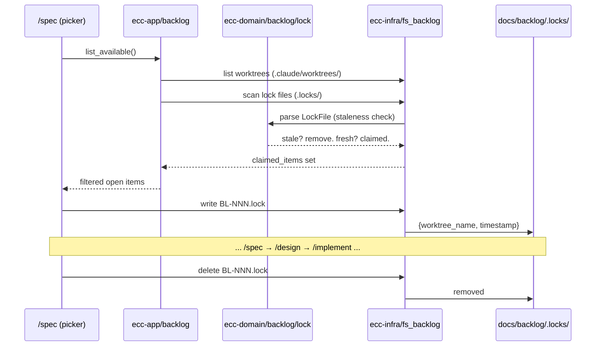

# Flow: Backlog Lock Protocol

## Overview

Cross-module flow for claiming and releasing backlog items across concurrent Claude Code sessions.

## Mermaid

## Transformation Steps

1. **Worktree scan** — List `.claude/worktrees/`, extract BL-NNN IDs via regex
2. **Lock scan** — Read `docs/backlog/.locks/*.lock`, parse each as `LockFile`
3. **Staleness check** — Domain `LockFile::is_stale()` checks 24h TTL + orphaned worktree
4. **Merge claims** — Union of worktree-claimed + lock-claimed IDs
5. **Filter** — Remove claimed items from open backlog entries
6. **Claim** — Write lock file on selection (worktree name + ISO 8601 timestamp)
7. **Release** — Delete lock file at implement-done phase

## Layers Touched

| Layer | File | Responsibility |
|-------|------|----------------|
| Domain | `backlog/lock.rs` | `LockFile` struct, staleness logic |
| Ports | `backlog.rs` | `BacklogLockStore` trait |
| Infra | `fs_backlog.rs` | Filesystem read/write of `.lock` files |
| App | `backlog.rs` | `collect_claimed_ids()` orchestration |

## GAP Annotations

- No distributed lock — file-based locks are advisory, not enforced across machines
- Lock-to-worktree validation is best-effort (worktree may be deleted before lock cleanup)
