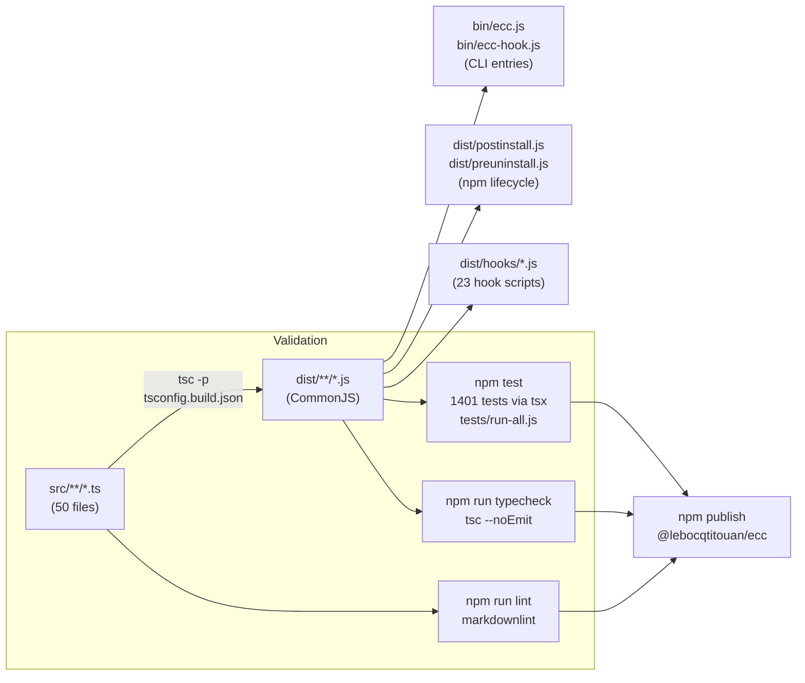

<!-- Generated by diagram-generator | Date: 2026-03-14 | Source: docs/ARCHITECTURE.md -->

# Build Pipeline

From TypeScript source to compiled output, testing, linting, and publishing.

## Related
- [Architecture](../ARCHITECTURE.md)
