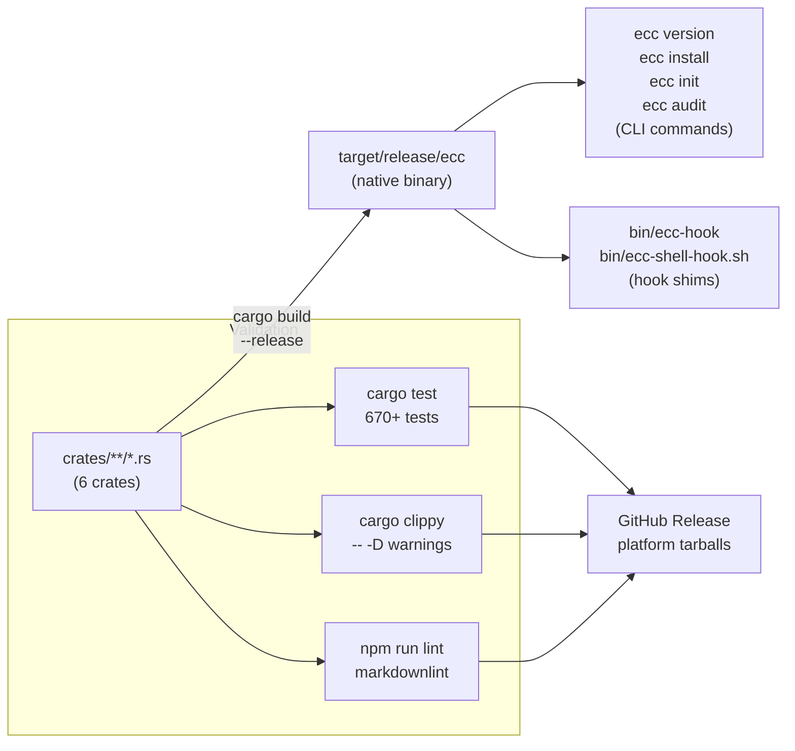

<!-- Generated by diagram-generator | Date: 2026-03-15 | Source: docs/ARCHITECTURE.md -->

# Build Pipeline

From Rust source to native binary, testing, linting, and release.

## Related
- [Architecture](../ARCHITECTURE.md)
