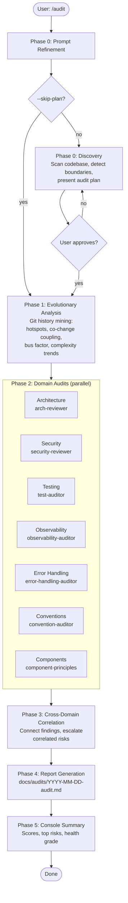

<!-- Generated by diagram-generator | Date: 2026-03-15 | Source: commands/audit.md -->

# /audit Command Workflow

```mermaid
flowchart TD
    START(["User: /audit"]) --> REFINE["Phase 0: Prompt Refinement"]

    REFINE --> SKIP{"--skip-plan?"}
    SKIP -->|no| DISCOVER["Phase 0: Discovery<br/>Scan codebase, detect boundaries,<br/>present audit plan"]
    SKIP -->|yes| EVOLUTION

    DISCOVER --> APPROVE{User approves?}
    APPROVE -->|no| DISCOVER
    APPROVE -->|yes| EVOLUTION

    EVOLUTION["Phase 1: Evolutionary Analysis<br/>Git history mining:<br/>hotspots, co-change coupling,<br/>bus factor, complexity trends"]

    EVOLUTION --> PARALLEL

    subgraph PARALLEL["Phase 2: Domain Audits (parallel)"]
        ARCH["Architecture<br/>arch-reviewer"]
        SEC["Security<br/>security-reviewer"]
        TEST["Testing<br/>test-auditor"]
        OBS["Observability<br/>observability-auditor"]
        ERR["Error Handling<br/>error-handling-auditor"]
        CONV["Conventions<br/>convention-auditor"]
        COMP["Components<br/>component-principles"]
    end

    PARALLEL --> CORRELATE["Phase 3: Cross-Domain Correlation<br/>Connect findings, escalate<br/>correlated risks"]

    CORRELATE --> REPORT["Phase 4: Report Generation<br/>docs/audits/YYYY-MM-DD-audit.md"]

    REPORT --> SUMMARY["Phase 5: Console Summary<br/>Scores, top risks, health grade"]

    SUMMARY --> DONE(["Done"])
```
