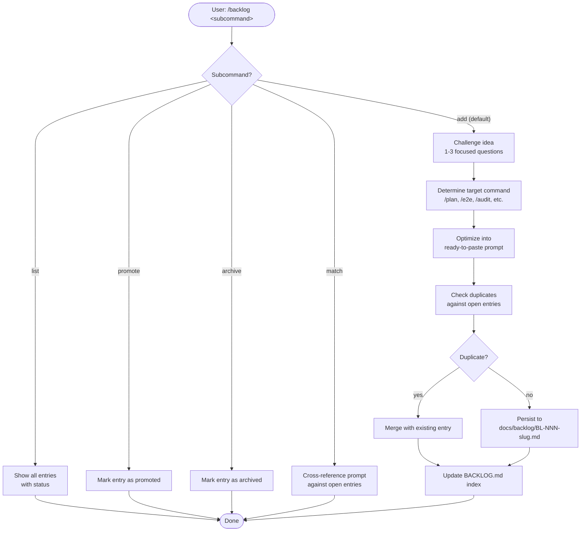

<!-- Generated by diagram-generator | Date: 2026-03-15 | Source: commands/backlog.md -->

# /backlog Command Workflow

```mermaid
flowchart TD
    START(["User: /backlog &lt;subcommand&gt;"]) --> SUB{Subcommand?}

    SUB -->|"add (default)"| CHALLENGE["Challenge idea<br/>1-3 focused questions"]
    SUB -->|list| LIST["Show all entries<br/>with status"]
    SUB -->|promote| PROMOTE["Mark entry as promoted"]
    SUB -->|archive| ARCHIVE["Mark entry as archived"]
    SUB -->|match| MATCH["Cross-reference prompt<br/>against open entries"]

    CHALLENGE --> TARGET["Determine target command<br/>/plan, /e2e, /audit, etc."]
    TARGET --> OPTIMIZE["Optimize into<br/>ready-to-paste prompt"]
    OPTIMIZE --> DEDUP["Check duplicates<br/>against open entries"]
    DEDUP --> DUP{Duplicate?}
    DUP -->|yes| MERGE["Merge with existing entry"]
    DUP -->|no| PERSIST["Persist to<br/>docs/backlog/BL-NNN-slug.md"]
    MERGE --> INDEX["Update BACKLOG.md index"]
    PERSIST --> INDEX

    LIST --> DONE(["Done"])
    PROMOTE --> DONE
    ARCHIVE --> DONE
    MATCH --> DONE
    INDEX --> DONE
```
