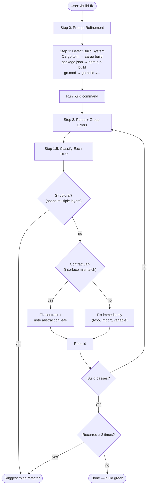

<!-- Generated by diagram-generator | Date: 2026-03-15 | Source: commands/build-fix.md -->

# /build-fix Command Workflow

```mermaid
flowchart TD
    START(["User: /build-fix"]) --> REFINE["Step 0: Prompt Refinement"]

    REFINE --> DETECT["Step 1: Detect Build System<br/>Cargo.toml → cargo build<br/>package.json → npm run build<br/>go.mod → go build ./..."]

    DETECT --> RUN["Run build command"]
    RUN --> PARSE["Step 2: Parse + Group Errors"]

    PARSE --> CLASSIFY["Step 1.5: Classify Each Error"]

    CLASSIFY --> STRUCTURAL{"Structural?<br/>(spans multiple layers)"}
    STRUCTURAL -->|yes| SUGGEST(["Suggest /plan refactor"])
    STRUCTURAL -->|no| CONTRACTUAL{"Contractual?<br/>(interface mismatch)"}
    CONTRACTUAL -->|yes| FIX_CONTRACT["Fix contract +<br/>note abstraction leak"]
    CONTRACTUAL -->|no| FIX_INCIDENTAL["Fix immediately<br/>(typo, import, variable)"]

    FIX_CONTRACT --> REBUILD["Rebuild"]
    FIX_INCIDENTAL --> REBUILD

    REBUILD --> PASS{Build passes?}
    PASS -->|no| PARSE
    PASS -->|yes| RECUR{"Recurred ≥ 2 times?"}
    RECUR -->|yes| SUGGEST
    RECUR -->|no| DONE(["Done — build green"])
```
