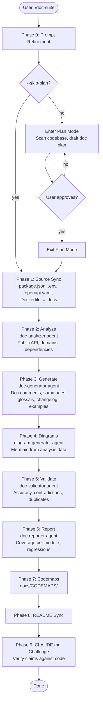

<!-- Generated by diagram-generator | Date: 2026-03-15 | Source: commands/doc-suite.md -->

# /doc-suite Command Workflow

```mermaid
flowchart TD
    START(["User: /doc-suite"]) --> REFINE["Phase 0: Prompt Refinement"]

    REFINE --> SKIP{"--skip-plan?"}
    SKIP -->|no| PLAN["Enter Plan Mode<br/>Scan codebase, draft doc plan"]
    SKIP -->|yes| SYNC

    PLAN --> APPROVE{User approves?}
    APPROVE -->|no| PLAN
    APPROVE -->|yes| EXIT["Exit Plan Mode"]
    EXIT --> SYNC

    SYNC["Phase 1: Source Sync<br/>package.json, .env, openapi.yaml,<br/>Dockerfile → docs"]

    SYNC --> ANALYZE["Phase 2: Analyze<br/>doc-analyzer agent<br/>Public API, domains, dependencies"]

    ANALYZE --> GENERATE["Phase 3: Generate<br/>doc-generator agent<br/>Doc comments, summaries,<br/>glossary, changelog, examples"]

    GENERATE --> DIAGRAMS["Phase 4: Diagrams<br/>diagram-generator agent<br/>Mermaid from analysis data"]

    DIAGRAMS --> VALIDATE["Phase 5: Validate<br/>doc-validator agent<br/>Accuracy, contradictions, duplicates"]

    VALIDATE --> REPORT["Phase 6: Report<br/>doc-reporter agent<br/>Coverage per module, regressions"]

    REPORT --> CODEMAPS["Phase 7: Codemaps<br/>docs/CODEMAPS/"]

    CODEMAPS --> README["Phase 8: README Sync"]

    README --> CHALLENGE["Phase 9: CLAUDE.md Challenge<br/>Verify claims against code"]

    CHALLENGE --> DONE(["Done"])
```
