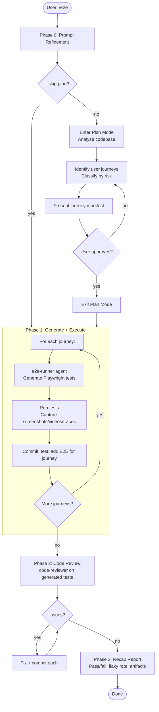

<!-- Generated by diagram-generator | Date: 2026-03-15 | Source: commands/e2e.md -->

# /e2e Command Workflow

```mermaid
flowchart TD
    START(["User: /e2e"]) --> REFINE["Phase 0: Prompt Refinement"]

    REFINE --> SKIP{"--skip-plan?"}
    SKIP -->|no| PLAN_MODE["Enter Plan Mode<br/>Analyze codebase"]
    SKIP -->|yes| GEN

    PLAN_MODE --> DISCOVER["Identify user journeys<br/>Classify by risk"]
    DISCOVER --> MANIFEST["Present journey manifest"]
    MANIFEST --> APPROVE{User approves?}
    APPROVE -->|no| DISCOVER
    APPROVE -->|yes| EXIT_PLAN["Exit Plan Mode"]

    EXIT_PLAN --> GEN

    subgraph GEN["Phase 1: Generate + Execute"]
        JOURNEY["For each journey:"]
        JOURNEY --> E2E_AGENT["e2e-runner agent<br/>Generate Playwright tests"]
        E2E_AGENT --> RUN_TEST["Run tests<br/>Capture screenshots/videos/traces"]
        RUN_TEST --> COMMIT_J["Commit: test: add E2E for journey"]
        COMMIT_J --> MORE_J{More journeys?}
        MORE_J -->|yes| JOURNEY
    end

    MORE_J -->|no| REVIEW["Phase 2: Code Review<br/>code-reviewer on generated tests"]
    REVIEW --> FINDINGS{Issues?}
    FINDINGS -->|yes| FIX["Fix + commit each"]
    FIX --> FINDINGS
    FINDINGS -->|no| RECAP["Phase 3: Recap Report<br/>Pass/fail, flaky rate, artifacts"]
    RECAP --> DONE(["Done"])
```
