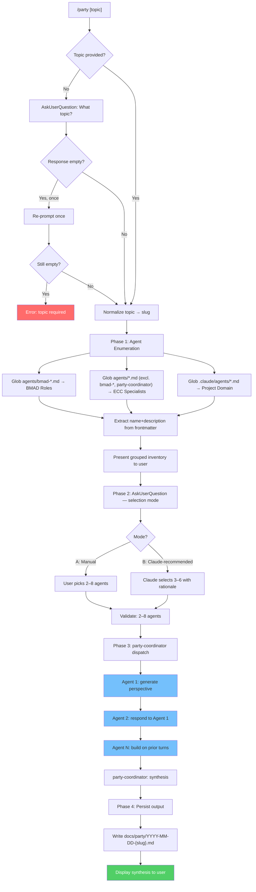
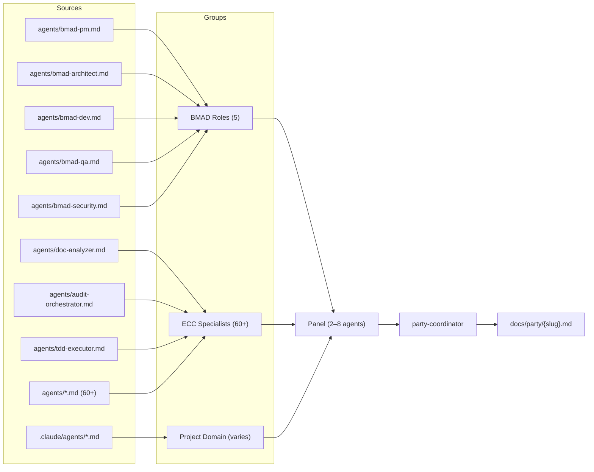

<!-- Generated by diagram-generator | Date: 2026-04-12 | Source: commands/party.md, agents/party-coordinator.md -->

# /party Command — Multi-Agent Round-Table

Workflow for `/party`: topic handling, agent enumeration, panel selection, sequential dispatch, and synthesis.

## Command Flow

## Agent Sources

## Related

- [/party command](../../commands/party.md)
- [party-coordinator agent](../../agents/party-coordinator.md)
- [Agent Orchestration](agent-orchestration.md)
