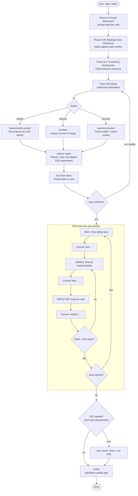

<!-- Generated by diagram-generator | Date: 2026-03-15 | Source: commands/plan.md -->

# /plan Command Workflow

```mermaid
flowchart TD
    START(["User: /plan &lt;task&gt;"]) --> REFINE["Phase 0: Prompt Refinement<br/>prompt-optimizer skill"]
    REFINE --> BACKLOG["Phase 0.25: Backlog Cross-Reference<br/>Match against open entries"]
    BACKLOG --> BOUNDARY["Phase 0.5: Screaming Architecture<br/>Check directory structure"]
    BOUNDARY --> PLAN_MODE["Enter Plan Mode<br/>(read-only exploration)"]

    PLAN_MODE --> MODE{Mode?}
    MODE -->|stories| STORIES["requirements-analyst<br/>Decompose into user stories"]
    MODE -->|refactor| REFACTOR["architect<br/>Analyze current vs target"]
    MODE -->|security| SECURITY["security-reviewer<br/>Threat model + attack surface"]

    STORIES --> PLANNER["planner agent<br/>Phases, risks, test targets,<br/>E2E assessment"]
    REFACTOR --> PLANNER
    SECURITY --> PLANNER

    PLANNER --> EXIT_PLAN["Exit Plan Mode<br/>Present plan to user"]
    EXIT_PLAN --> CONFIRM{User confirms?}
    CONFIRM -->|"no / modify"| PLAN_MODE
    CONFIRM -->|yes| TDD

    subgraph TDD["TDD Execution (per phase)"]
        RED["RED: Write failing tests"] --> COMMIT_T["Commit: test: ..."]
        COMMIT_T --> GREEN["GREEN: Minimal implementation"]
        GREEN --> COMMIT_I["Commit: feat: ..."]
        COMMIT_I --> REFACTOR2["REFACTOR: Improve code"]
        REFACTOR2 --> COMMIT_R["Commit: refactor: ..."]
        COMMIT_R --> GATE{"Build + tests pass?"}
        GATE -->|no| GREEN
        GATE -->|yes| NEXT{More phases?}
        NEXT -->|yes| RED
    end

    NEXT -->|no| E2E{"E2E needed?<br/>(from plan assessment)"}
    E2E -->|yes| E2E_WRITE["e2e-runner: Write + run E2E"]
    E2E -->|no| VERIFY
    E2E_WRITE --> VERIFY["/verify<br/>Mandatory quality gate"]
    VERIFY --> DONE(["Done"])
```
