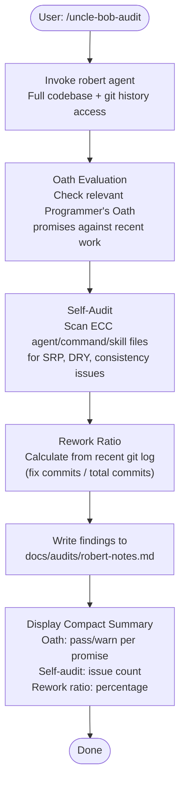

<!-- Generated by diagram-generator | Date: 2026-03-15 | Source: commands/uncle-bob-audit.md -->

# /uncle-bob-audit Command Workflow

```mermaid
flowchart TD
    START(["User: /uncle-bob-audit"]) --> INVOKE["Invoke robert agent<br/>Full codebase + git history access"]

    INVOKE --> OATH["Oath Evaluation<br/>Check relevant Programmer's Oath<br/>promises against recent work"]

    OATH --> SELF["Self-Audit<br/>Scan ECC agent/command/skill files<br/>for SRP, DRY, consistency issues"]

    SELF --> REWORK["Rework Ratio<br/>Calculate from recent git log<br/>(fix commits / total commits)"]

    REWORK --> WRITE["Write findings to<br/>docs/audits/robert-notes.md"]

    WRITE --> SUMMARY["Display Compact Summary<br/>Oath: pass/warn per promise<br/>Self-audit: issue count<br/>Rework ratio: percentage"]

    SUMMARY --> DONE(["Done"])
```
