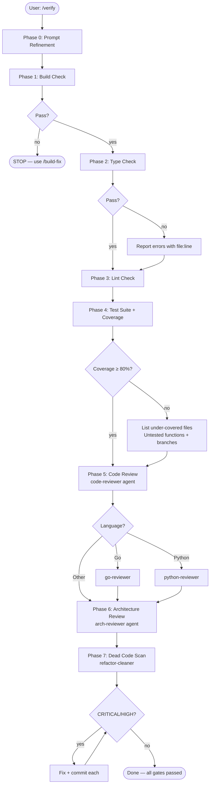

<!-- Generated by diagram-generator | Date: 2026-03-15 | Source: commands/verify.md -->

# /verify Command Workflow

```mermaid
flowchart TD
    START(["User: /verify"]) --> REFINE["Phase 0: Prompt Refinement"]

    REFINE --> BUILD["Phase 1: Build Check"]
    BUILD --> BUILD_OK{Pass?}
    BUILD_OK -->|no| STOP_BUILD(["STOP — use /build-fix"])
    BUILD_OK -->|yes| TYPE["Phase 2: Type Check"]

    TYPE --> TYPE_OK{Pass?}
    TYPE_OK -->|no| REPORT_TYPE["Report errors with file:line"]
    TYPE_OK -->|yes| LINT["Phase 3: Lint Check"]
    REPORT_TYPE --> LINT

    LINT --> TESTS["Phase 4: Test Suite + Coverage"]
    TESTS --> COV{Coverage ≥ 80%?}
    COV -->|no| COV_REPORT["List under-covered files<br/>Untested functions + branches"]
    COV -->|yes| REVIEW

    COV_REPORT --> REVIEW["Phase 5: Code Review<br/>code-reviewer agent"]

    REVIEW --> LANG{Language?}
    LANG -->|Go| GO_REV["go-reviewer"]
    LANG -->|Python| PY_REV["python-reviewer"]
    LANG -->|Other| ARCH_REV

    GO_REV --> ARCH_REV["Phase 6: Architecture Review<br/>arch-reviewer agent"]
    PY_REV --> ARCH_REV

    ARCH_REV --> DEAD["Phase 7: Dead Code Scan<br/>refactor-cleaner"]

    DEAD --> ISSUES{CRITICAL/HIGH?}
    ISSUES -->|yes| FIX["Fix + commit each"]
    FIX --> ISSUES
    ISSUES -->|no| DONE(["Done — all gates passed"])
```
