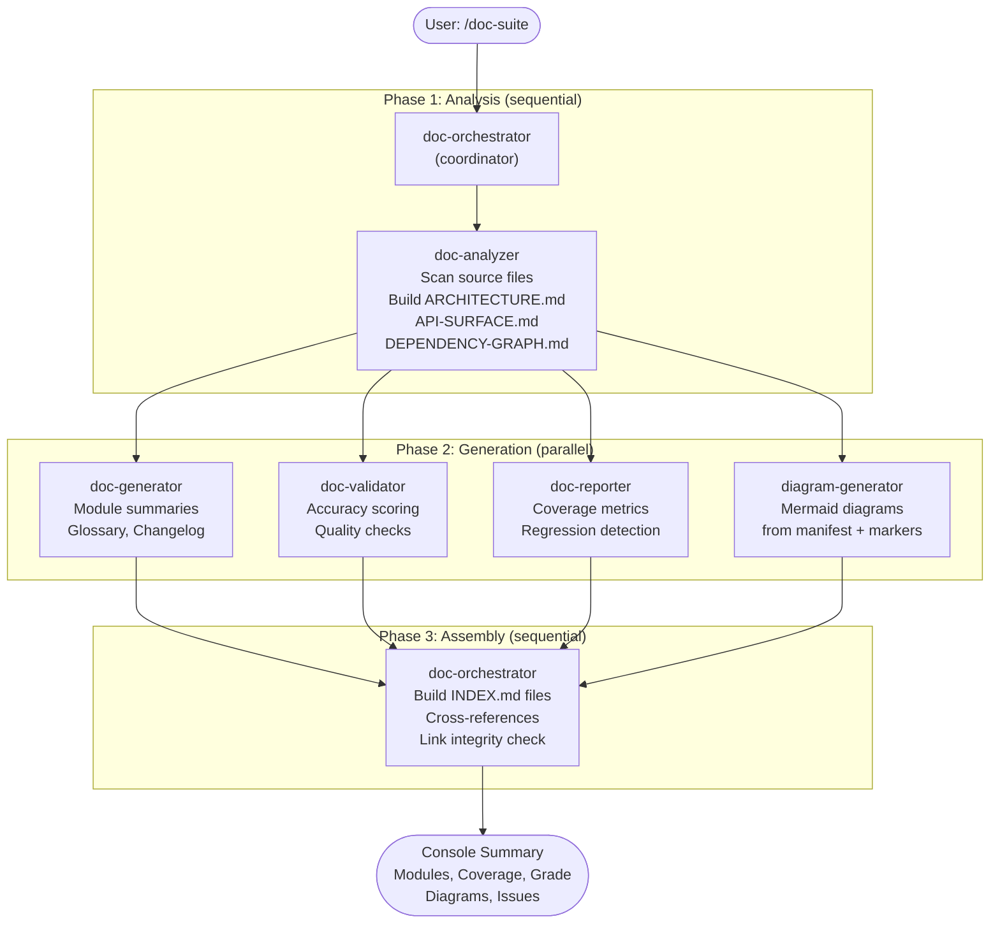

<!-- Generated by diagram-generator | Date: 2026-03-09 | Source: docs/ARCHITECTURE.md -->

# Doc-Suite Agent Pipeline

The `/doc-suite` 6-agent pipeline: `doc-orchestrator` delegates to 5 specialized agents in phased execution with parallelism in Phase 2.

## Related
- [Architecture](../ARCHITECTURE.md)
- [Agent Orchestration (manual)](agent-orchestration.md)
