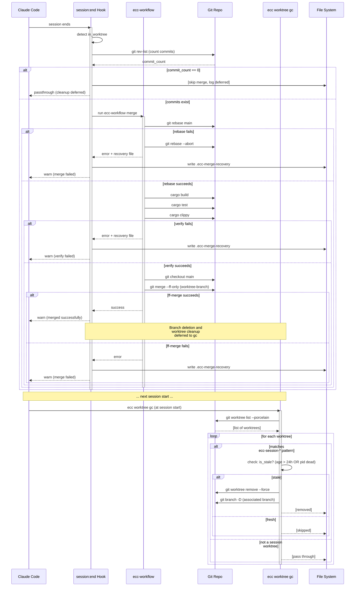

<!-- Generated by diagram-updater | Date: 2026-04-06 | Source: docs/specs/2026-04-06-worktree-auto-merge-cleanup/spec.md -->

# Worktree Auto-Merge and Cleanup — Sequence Diagram

Sequence diagram showing the post-session merge and deferred cleanup workflow.

