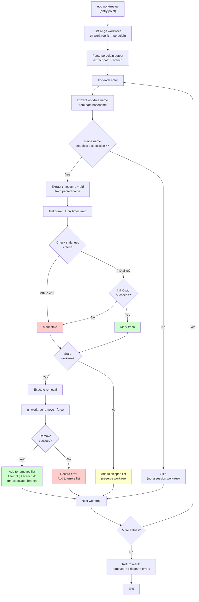

<!-- Generated by diagram-updater | Date: 2026-04-06 | Source: docs/specs/2026-04-06-worktree-auto-merge-cleanup/design.md -->

# Worktree GC Refactored — Flowchart

Garbage collection refactored to use port-based abstraction, with deterministic staleness checks.

