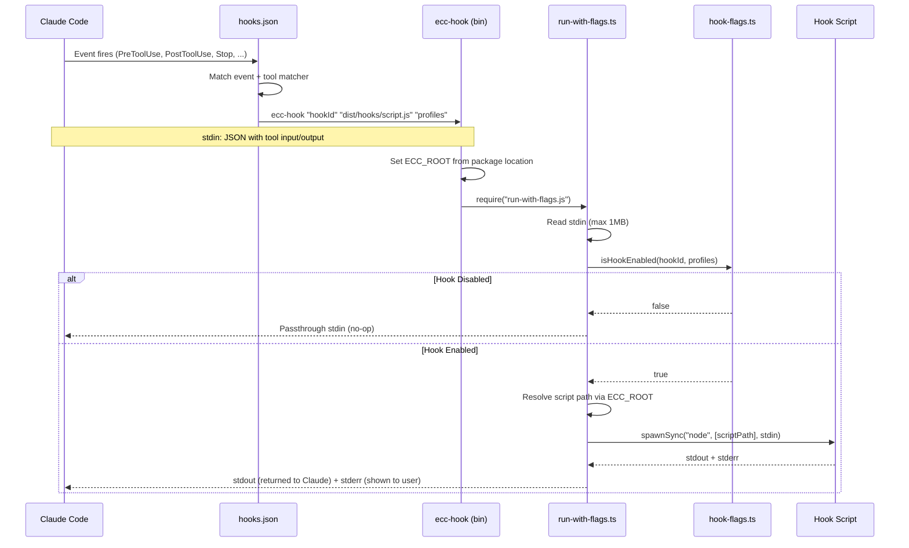

<!-- Generated by diagram-generator | Date: 2026-03-09 | Source: docs/ARCHITECTURE.md -->

# Hook Execution Flow

Sequence showing how Claude Code triggers hooks through `ecc-hook` and `run-with-flags.js` with profile-based gating.

## Related
- [Architecture](../ARCHITECTURE.md)
- [Module Dependency Graph](module-dependency-graph.md)
