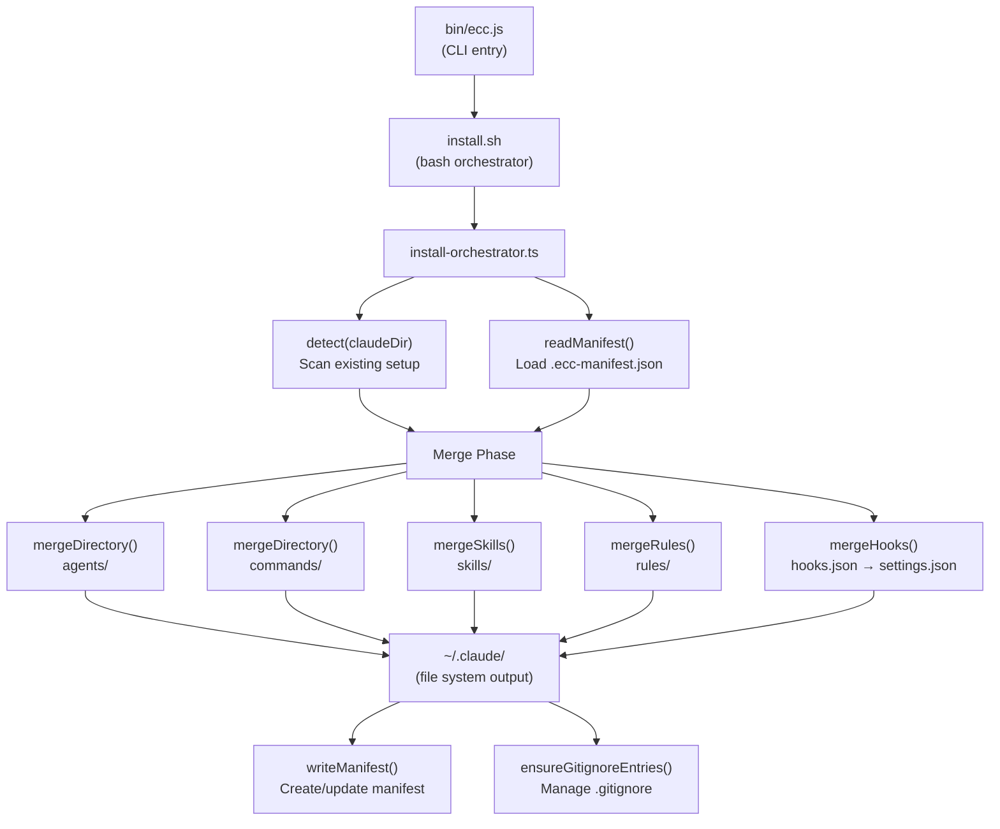

<!-- Generated by diagram-generator | Date: 2026-03-09 | Source: docs/ARCHITECTURE.md -->

# Install Data Flow

The `ecc install` pipeline from CLI entry through detection, merging, and file-system output.

## Related
- [Architecture](../ARCHITECTURE.md)
- [Module Dependency Graph](module-dependency-graph.md)
