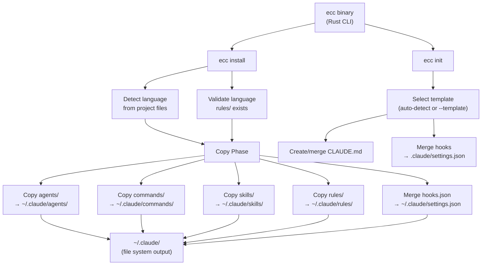

<!-- Generated by diagram-generator | Date: 2026-03-15 | Source: docs/ARCHITECTURE.md -->

# Install Data Flow

The `ecc install` pipeline from CLI entry through content copying and hook merging.

## Related
- [Architecture](../ARCHITECTURE.md)
