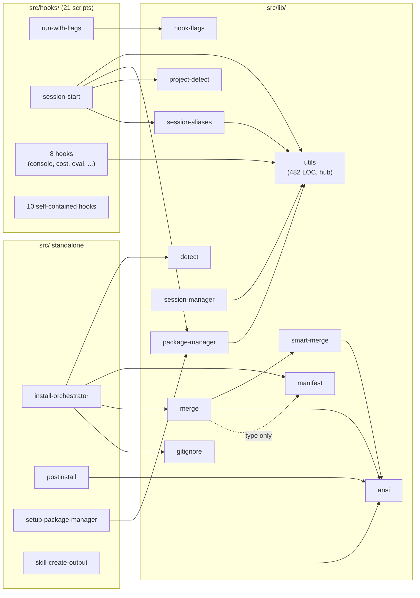

<!-- Generated by diagram-generator | Date: 2026-03-09 | Source: docs/ARCHITECTURE.md -->

# Module Dependency Graph

Import relationships between all `src/` modules, with `utils` as the primary hub (fan-in 11).

## Related
- [Architecture](../ARCHITECTURE.md)
- [Dependency Graph](../DEPENDENCY-GRAPH.md)
- [API Surface](../API-SURFACE.md)
