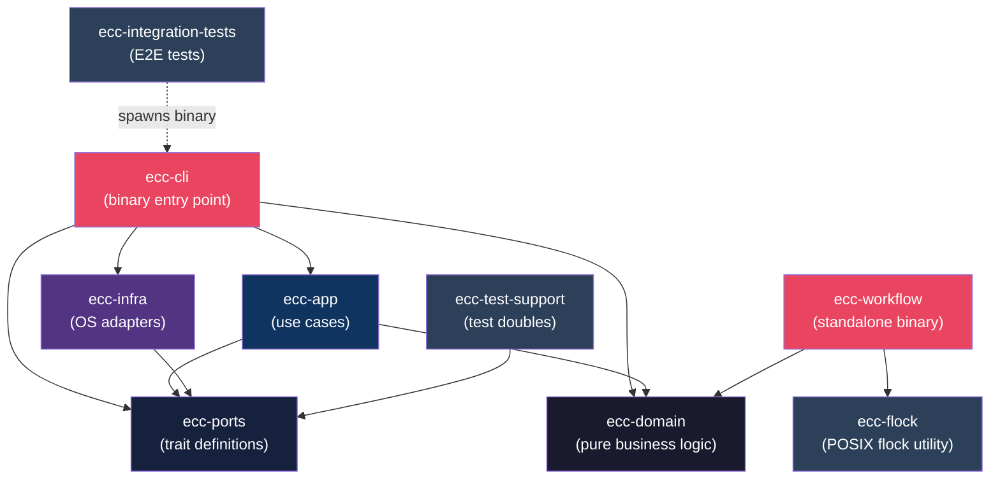

<!-- Generated by diagram-generator | Date: 2026-03-15 | Source: Cargo.toml, crates/ -->

# Module Dependency Graph

Hexagonal architecture crate dependencies. `ecc-domain` is the pure core with zero I/O; each outer layer depends inward only.

## Related
- [Architecture](../ARCHITECTURE.md)
- [Dependency Graph](../DEPENDENCY-GRAPH.md)
- [API Surface](../API-SURFACE.md)
