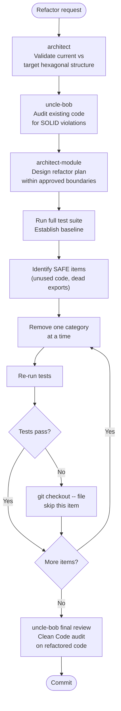

<!-- Generated by diagram-generator | Date: 2026-03-15 | Source: agents/refactor-cleaner.md, commands/spec.md -->

# Refactoring Flow

```mermaid
flowchart TD
    START(["Refactor request"]) --> ARCH["architect<br/>Validate current vs<br/>target hexagonal structure"]

    ARCH --> UB["uncle-bob<br/>Audit existing code<br/>for SOLID violations"]

    UB --> PLAN["architect-module<br/>Design refactor plan<br/>within approved boundaries"]

    PLAN --> TESTS["Run full test suite<br/>Establish baseline"]

    TESTS --> SAFE["Identify SAFE items<br/>(unused code, dead exports)"]
    SAFE --> DELETE["Remove one category<br/>at a time"]
    DELETE --> VERIFY["Re-run tests"]

    VERIFY --> PASS{Tests pass?}
    PASS -->|No| REVERT["git checkout -- file<br/>skip this item"]
    PASS -->|Yes| MORE{More items?}

    MORE -->|Yes| DELETE
    MORE -->|No| UB2["uncle-bob final review<br/>Clean Code audit<br/>on refactored code"]

    UB2 --> COMMIT(["Commit"])
    REVERT --> MORE
```
