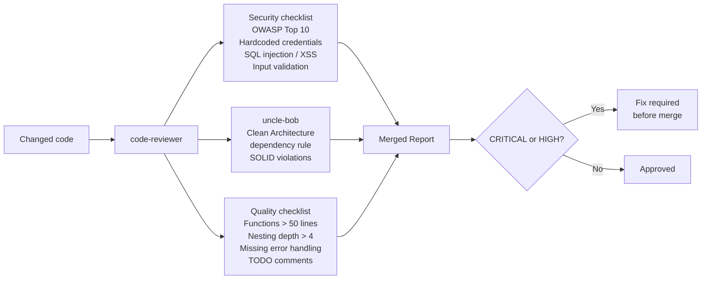

# Security Review Flow

```mermaid
flowchart LR
    CODE["Changed code"] --> CR["code-reviewer"]

    CR --> SEC["Security checklist<br/>OWASP Top 10<br/>Hardcoded credentials<br/>SQL injection / XSS<br/>Input validation"]

    CR --> UB["uncle-bob<br/>Clean Architecture<br/>dependency rule<br/>SOLID violations"]

    CR --> QUAL["Quality checklist<br/>Functions > 50 lines<br/>Nesting depth > 4<br/>Missing error handling<br/>TODO comments"]

    SEC --> MERGE["Merged Report"]
    UB --> MERGE
    QUAL --> MERGE

    MERGE --> BLOCK{CRITICAL or HIGH?}
    BLOCK -->|Yes| FIX["Fix required<br/>before merge"]
    BLOCK -->|No| APPROVE["Approved"]
```
