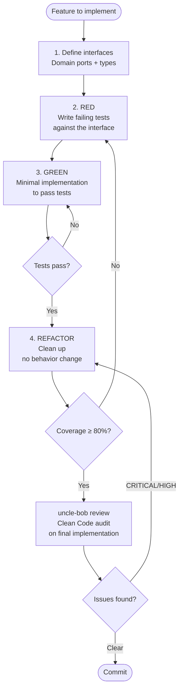

<!-- Generated by diagram-generator | Date: 2026-03-15 | Source: commands/plan.md, agents/tdd-guide.md -->

# TDD Workflow

```mermaid
flowchart TD
    START(["Feature to implement"]) --> INTERFACE["1. Define interfaces<br/>Domain ports + types"]

    INTERFACE --> RED["2. RED<br/>Write failing tests<br/>against the interface"]

    RED --> GREEN["3. GREEN<br/>Minimal implementation<br/>to pass tests"]

    GREEN --> CHECK{Tests pass?}
    CHECK -->|No| GREEN
    CHECK -->|Yes| REFACTOR["4. REFACTOR<br/>Clean up<br/>no behavior change"]

    REFACTOR --> COVERAGE{Coverage ≥ 80%?}
    COVERAGE -->|No| RED
    COVERAGE -->|Yes| UB["uncle-bob review<br/>Clean Code audit<br/>on final implementation"]

    UB --> ISSUES{Issues found?}
    ISSUES -->|CRITICAL/HIGH| REFACTOR
    ISSUES -->|Clear| DONE(["Commit"])
```
