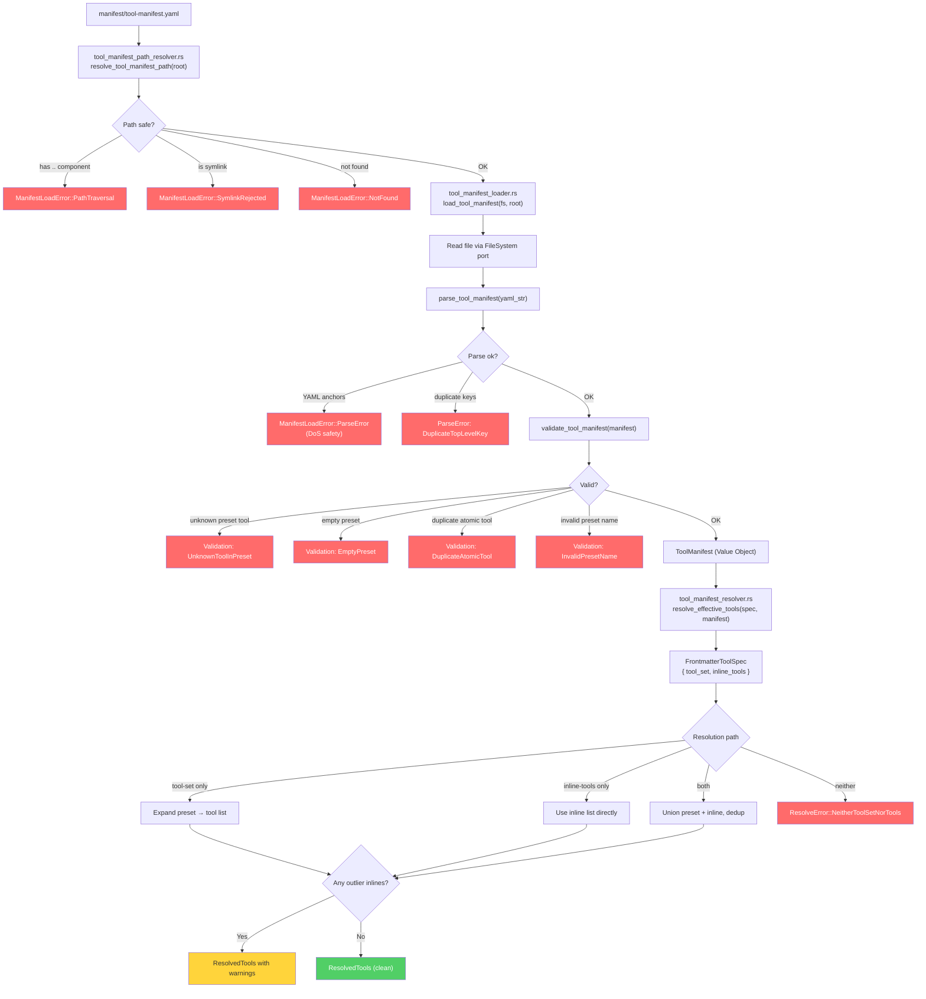
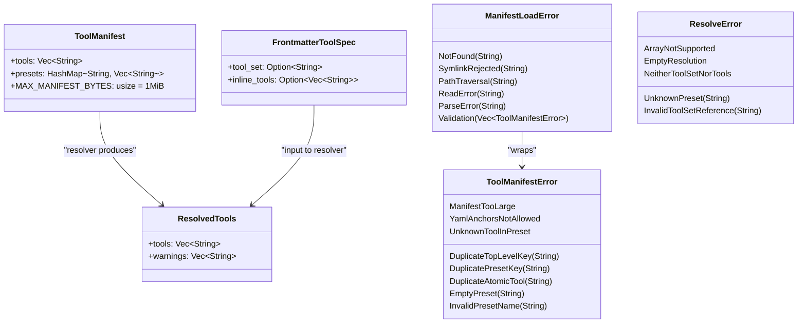

<!-- Generated by diagram-generator | Date: 2026-04-12 | Source: BL-146 tool manifest modules -->

# Tool Manifest Resolution — BL-146

Data flow for declarative tool manifest: YAML file → domain parse → resolver → effective tool list per agent.

## Resolution Pipeline

## Data Types

## Crate Ownership

| Module | Crate | Role |
|--------|-------|------|
| `tool_manifest.rs` | `ecc-domain` | Value Object, parse + validate (pure) |
| `tool_manifest_resolver.rs` | `ecc-domain` | Pure resolver (no I/O) |
| `tool_manifest_path_resolver.rs` | `ecc-app` | Canonical path computation |
| `tool_manifest_loader.rs` | `ecc-app` | FileSystem port integration |

## Related

- [Architecture](../ARCHITECTURE.md)
- [API Surface](../API-SURFACE.md)
- BL-146 spec: `docs/specs/`
