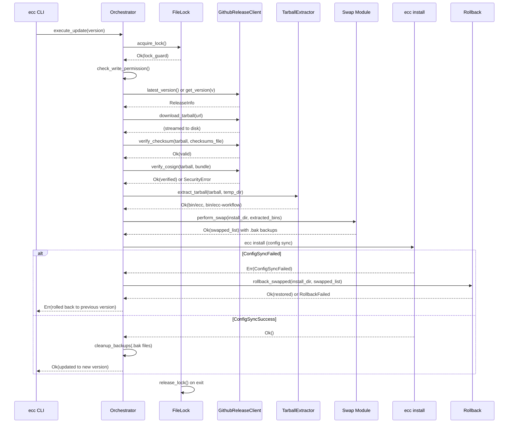
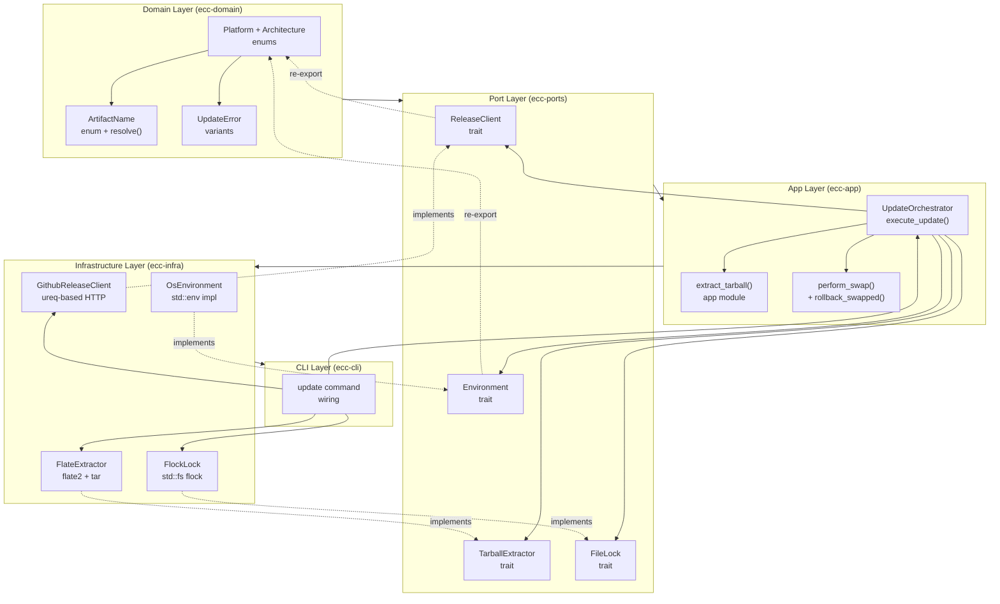
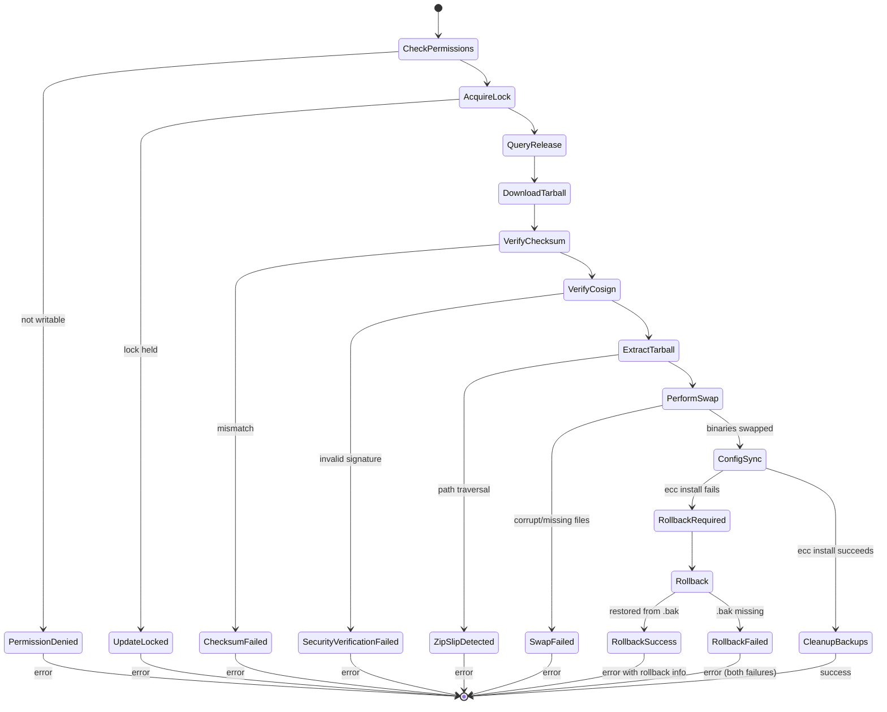
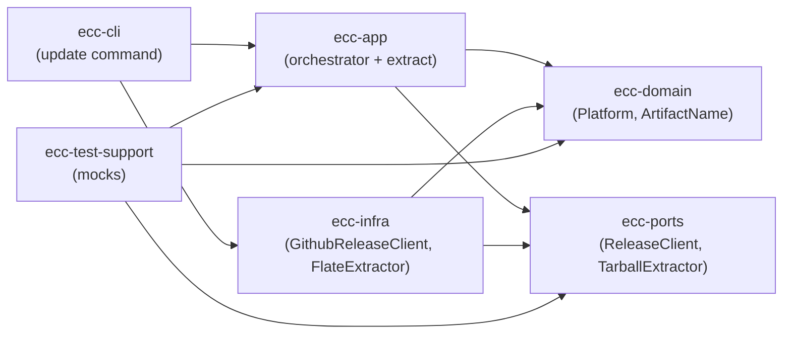

<!-- Generated by diagram-updater | Date: 2026-03-31 | Source: BL-088 spec + design -->

# BL-088 — ecc update Feature Diagrams

## 1. Update Flow Sequence Diagram

This diagram illustrates the complete update flow from CLI invocation through rollback handling:

## 2. Component Dependency Diagram

This diagram shows the hexagonal architecture layers for the update feature:

## 3. Update State Transitions

This diagram shows the key state transitions during the update process:

## 4. Cross-Crate Dependency Surface

This diagram shows which crates interact for the update feature:

