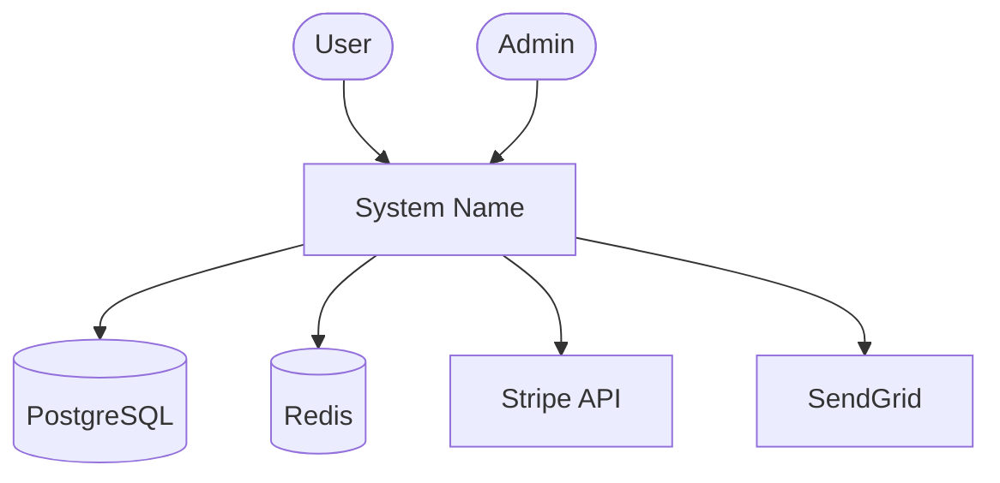

# Architecture Documentation Generation

Generation skill for producing structured architecture documentation following the C4 model. Transforms analysis data into layered views that serve different audiences — from executives to developers.

## When to Activate

- During doc-generator pipeline for architecture documentation
- When creating or updating `docs/ARCHITECTURE.md`
- When onboarding needs system-level understanding
- After significant architectural changes

## Methodology

### 1. View Selection

Not every project needs all four C4 levels. Select based on codebase size:

| Codebase | Views to Generate |
|----------|-------------------|
| Small (<50 files) | Component + Code |
| Medium (50-200 files) | Container + Component |
| Large (200+ files) | System Context + Container + Component |
| Microservices | All four levels |

### 2. System Context View (L1)

**Audience:** Non-technical stakeholders, new team members

Document:
- The system as a single box
- External actors (users, admins, other systems)
- External systems it integrates with (databases, APIs, message queues)
- Data flows between actors and the system

```markdown
## System Context

[System Name] is a [brief description] used by [actors].

External dependencies:
- **PostgreSQL** — primary data store
- **Redis** — session cache and rate limiting
- **Stripe API** — payment processing
- **SendGrid** — transactional email


```

### 3. Container View (L2)

**Audience:** Technical leads, DevOps

Document:
- Major deployable units (API server, web app, worker, CLI)
- Technology choices per container
- Communication protocols between containers
- Data stores and their contents

### 4. Component View (L3)

**Audience:** Developers

Document:
- Modules within each container
- Module responsibilities (single-sentence)
- Dependencies between modules (import graph)
- Key interfaces at module boundaries

This is the most common view and the one produced by doc-analyzer. Structure:

```markdown
## Components

### src/lib/ — Core Library
Business logic, merge operations, package management utilities.
**Key exports:** mergeDirectory, resolveConflicts, PackageManager
**Depends on:** src/hooks/ (event emission)

### src/hooks/ — Hook System
Git hook management, session tracking, event bus.
**Key exports:** installHooks, SessionTracker, EventBus
**Depends on:** src/lib/ (utility functions)

### src/ci/ — CI Integration
CI environment detection, pipeline helpers.
**Key exports:** detectCI, CIProvider
**Depends on:** src/lib/ (config reading)
```

### 5. Code View (L4)

**Audience:** Developers working on specific modules

Only generate for complex modules (high cyclomatic complexity or many exports):
- Class/type hierarchies
- Key function call flows
- State machines (if applicable)
- Data transformation pipelines

### 6. Cross-Cutting Concerns

Document concerns that span multiple components:

- **Error handling strategy**: How errors propagate across layers
- **Configuration**: How config flows from env/files to modules
- **Logging**: Logging approach and correlation
- **Security**: Authentication/authorization boundaries
- **Testing**: Test strategy per layer

### 7. Mermaid Diagram Integration

Generate diagrams using Mermaid syntax for each view. Follow the diagram-generation skill conventions:

- Use `subgraph` for grouping related components
- Use directional arrows showing data flow
- Keep node count under 15 per diagram (split if larger)
- Use consistent node IDs across diagrams

## Template

See `skills/architecture-gen/assets/c4-template.md` for the skeleton template.

## Output

- **Primary file**: `docs/ARCHITECTURE.md`
- **Format**: Markdown with embedded Mermaid diagrams
- **Header**: `<!-- Generated by doc-generator | Date: YYYY-MM-DD -->`
- **Sections**: Selected C4 views + cross-cutting concerns

## Related

- C4 template: `skills/architecture-gen/assets/c4-template.md`
- Symbol extraction: `skills/symbol-extraction/SKILL.md`
- Dependency docs: `skills/dependency-docs/SKILL.md`
- Doc analyzer agent: `agents/doc-analyzer.md`
- Diagram generation skill: `skills/diagram-generation/SKILL.md`
