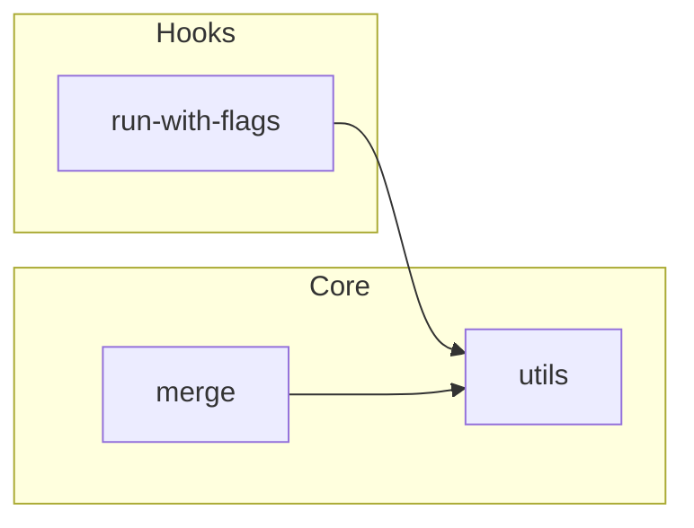
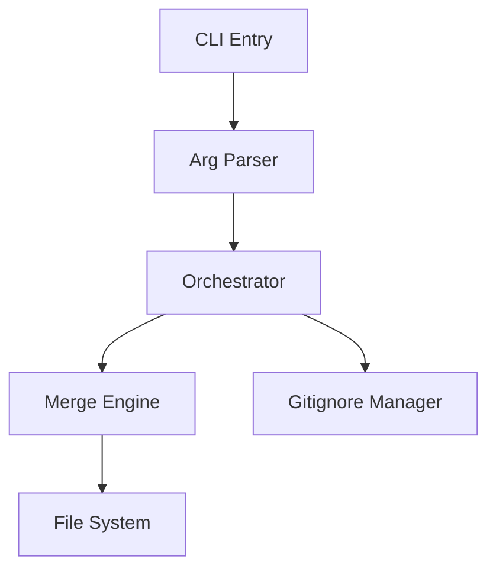
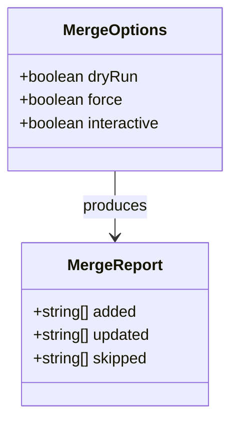
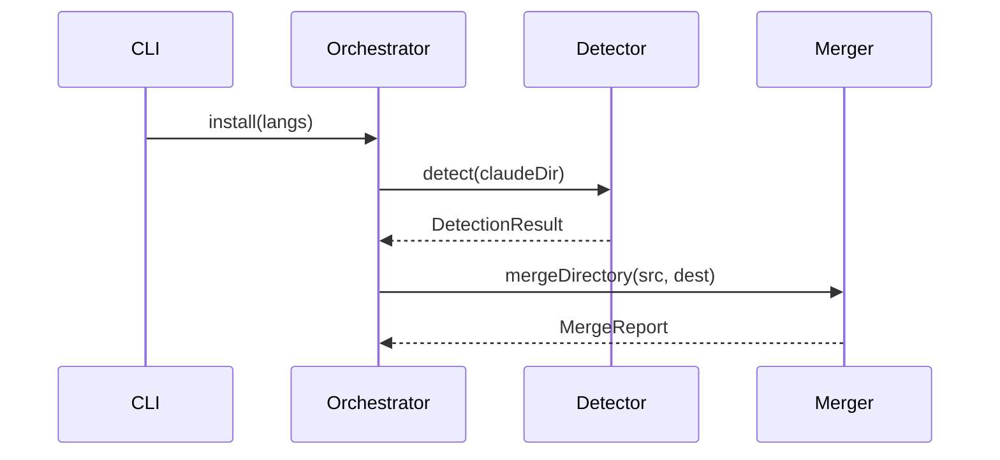
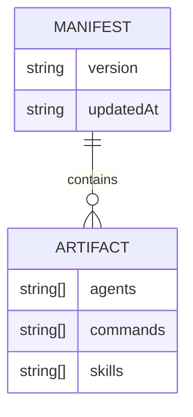
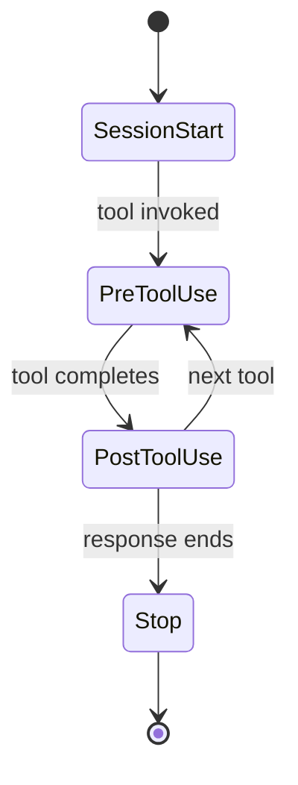
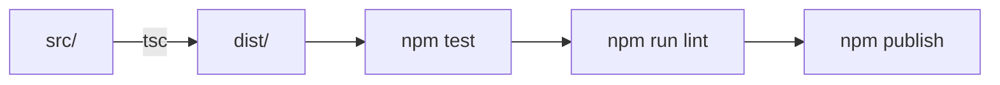
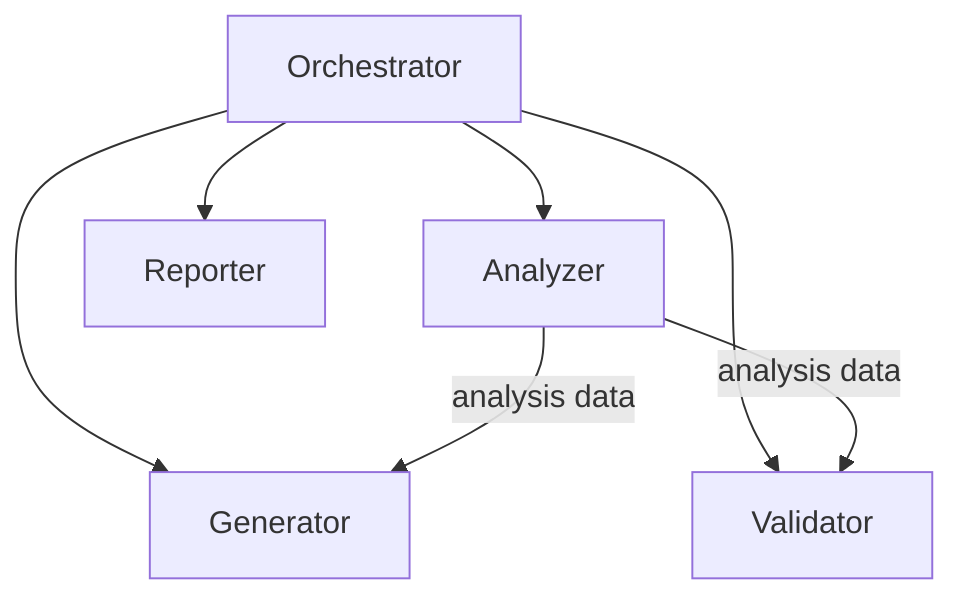

# Diagram Generation

Reference skill for the `diagram-generator` agent. Contains the catalog of diagram types, when to use each, Mermaid syntax patterns, and common mistakes to avoid.

## When to Activate

- Running `/doc-suite` or `/doc-diagrams`
- When doc files contain `<!-- DIAGRAM: ... -->` markers
- When `doc-analyzer` produces a diagram manifest
- When manually creating architecture or data-flow diagrams

## Diagram Type Catalog

### 1. Module Dependency Graph

**Mermaid type:** `flowchart LR`
**When:** Always, if 3+ modules with cross-dependencies exist.
**Source:** Import/require analysis, `docs/DEPENDENCY-GRAPH.md`.



### 2. Data Flow

**Mermaid type:** `flowchart TD`
**When:** System has clear entry points with multi-layer processing (CLI -> service -> storage).
**Source:** Entry point tracing, call graph.



### 3. Class / Type Hierarchy

**Mermaid type:** `classDiagram`
**When:** 3+ classes or interfaces with inheritance, composition, or implementation relationships.
**Source:** Type/class exports from API surface.



### 4. Sequence Diagram

**Mermaid type:** `sequenceDiagram`
**When:** A multi-step process spans 3+ modules (install flow, request handling, hook execution).
**Source:** Call graph tracing, entry point analysis.



### 5. Entity Relationship

**Mermaid type:** `erDiagram`
**When:** Database models, ORM entities, or structured data types with named relationships.
**Source:** Model/interface analysis.



### 6. State Machine

**Mermaid type:** `stateDiagram-v2`
**When:** Code has explicit state transitions (enum-like statuses, lifecycle hooks, FSM patterns).
**Source:** Enum/constant analysis.



### 7. Build / CI Pipeline

**Mermaid type:** `flowchart LR`
**When:** Project has build steps, CI config, or multi-stage compilation.
**Source:** package.json scripts, CI config files, Makefile.



### 8. Agent Orchestration

**Mermaid type:** `flowchart TD`
**When:** Project uses multi-agent patterns with delegation.
**Source:** Agent definitions and delegation patterns.



## Selection Heuristics

Use these rules to decide which diagrams to generate:

| Signal | Diagram |
|--------|---------|
| 3+ modules with cross-imports | Module dependency graph |
| CLI entry point -> service -> storage chain | Data flow |
| 3+ exported interfaces/classes with extends/implements | Class hierarchy |
| Multi-step flow crossing 3+ modules | Sequence diagram |
| Structured types with named relationships | ER diagram |
| Enum with 3+ state-like values, or lifecycle hooks | State machine |
| package.json scripts or CI pipeline config | Build pipeline |
| Agent markdown files with delegation patterns | Agent orchestration |

## Styling Conventions

- **Node shapes:** Rectangles for modules/services, rounded `([ ])` for start/end, diamonds `{ }` for decisions, stadium `([ ])` for events
- **Subgraphs:** Group related nodes when 8+ total nodes exist
- **Direction:** `TD` for hierarchical/layered, `LR` for sequential/pipeline flows
- **Max nodes:** 15 per flowchart (collapse low-importance nodes into groups)
- **Max participants:** 10 per sequence diagram
- **Legend:** Include a Key section when diagram has 5+ nodes with mixed shapes

## Common Mistakes

1. **Unquoted special characters in labels:** Node labels containing `(`, `)`, `[`, `]`, `{`, `}` must be quoted: `A["merge()"]` not `A[merge()]`
2. **Spaces in node IDs:** Node IDs cannot contain spaces. Use camelCase or hyphens: `installFlow` not `install flow`
3. **Missing `end` for subgraphs:** Every `subgraph` must have a matching `end`
4. **Invalid arrow syntax:** Use `-->` (solid), `-.->` (dotted), `==>` (thick). Not `->` or `-->`
5. **Duplicate node IDs:** Each ID must be unique within the diagram. Use prefixes for disambiguation
6. **Long labels:** Keep labels under 40 characters. Use `<br/>` for line breaks in node labels (`\n` does NOT work in Mermaid)
7. **Undefined references:** Every node referenced in an arrow must be defined somewhere in the diagram
8. **classDiagram methods:** Use `+method()` for public, `-method()` for private, `#method()` for protected
9. **Reserved word `end` as node ID:** `end` is a Mermaid keyword. Never use it as a node ID — use `finish`, `done`, or `End` instead.
10. **Unquoted edge labels:** Edge labels with special characters must be quoted: `A -->|"label text"| B`
11. **Missing `end` in sequence diagram blocks:** Every `alt`, `opt`, `loop`, `par` block MUST have a matching `end`

## Pitfall Examples

### Unquoted labels with special characters

BAD:
```
flowchart LR
    A(Start here) --> B{Is it valid?}
    B -->|Yes| C(Done (finally))
```

GOOD — everything quoted:
```
flowchart LR
    A["Start here"] --> B{"Is it valid?"}
    B -->|"Yes"| C["Done (finally)"]
```

### Reserved word "end" as node ID

BAD:
```
flowchart LR
    start --> process --> end
```

GOOD — renamed to avoid reserved word:
```
flowchart LR
    start --> process --> finish
```

### Missing "end" in sequence diagram

BAD:
```
sequenceDiagram
    Alice->>Bob: Hello
    alt is happy
        Bob->>Alice: Great!
```

GOOD — matching "end" keyword:
```
sequenceDiagram
    Alice->>Bob: Hello
    alt is happy
        Bob->>Alice: Great!
    end
```

## Validation

Every generated diagram should be validated before writing. The `diagram-generator` agent uses a **generate → validate → fix** loop:

1. **Quick check**: Verify the first line declares a valid diagram type and that brackets are balanced
2. **mmdc validation**: If `mmdc` (mermaid-cli) is available, run the diagram through the official parser
3. **Fix loop**: On parse error, read the error, fix only that issue, re-validate (max 3 retries)

## Marker Syntax

Doc files declare diagram needs using HTML comment markers:

```markdown
<!-- DIAGRAM: type=flowchart scope=src/lib title="Library Dependencies" direction=LR -->
```

**Parameters:**

| Param | Required | Values | Default |
|-------|----------|--------|---------|
| `type` | Yes | `flowchart`, `sequence`, `class`, `er`, `state` | - |
| `scope` | No | Module name, file path, or `*` | `*` |
| `title` | No | Free text | Auto-generated |
| `direction` | No | `TD`, `LR`, `BT`, `RL` | `TD` |

**Output placement:**

```markdown
<!-- DIAGRAM: type=flowchart scope=src/lib title="Dependencies" -->
<!-- DIAGRAM-START -->

<!-- DIAGRAM-END -->
```

On re-runs, content between `DIAGRAM-START` and `DIAGRAM-END` is replaced. Content outside these fences is never touched.

## Custom Diagram Registry

Users can register additional diagrams in `docs/diagrams/CUSTOM.md` so they are regenerated on every `/doc-suite` or `/doc-diagrams` run. Unlike manual diagrams (which are never touched), custom-registered diagrams are regenerated from their declared source context.

### Format

```markdown
# Custom Diagrams

| File | Type | Title | Source Context | Description |
|------|------|-------|---------------|-------------|
| agent-orchestration.md | flowchart | Agent Orchestration | agents/*.md, commands/spec.md, rules/common/agents.md | Full development flow with planner, TDD, and code-reviewer agents |
| tdd-workflow.md | flowchart | TDD Workflow | commands/tdd.md, agents/tdd-guide.md, skills/tdd-workflow/ | RED-GREEN-REFACTOR cycle with coverage gates |
```

### Field Reference

| Field | Required | Description |
|-------|----------|-------------|
| `File` | Yes | Filename in `docs/diagrams/` (must end in `.md`) |
| `Type` | Yes | Mermaid diagram type: `flowchart`, `sequence`, `class`, `er`, `state` |
| `Title` | Yes | Human-readable title used as the `# Heading` |
| `Source Context` | Yes | Comma-separated globs of files to read for content (agents, commands, skills, source files) |
| `Description` | No | One-line description for the INDEX.md catalog |

### Behavior

1. The diagram-generator reads `docs/diagrams/CUSTOM.md` as an additional source of diagram requests (alongside markers, manifest, and auto-detection)
2. For each entry, it reads the files listed in `Source Context` to understand the domain, then generates the diagram
3. Output files get the `<!-- Generated by diagram-generator -->` header so they are recognized as auto-managed
4. Custom entries take priority over auto-detection for the same file (no duplicates)
5. If a file listed in CUSTOM.md already exists without the generated header, the generator overwrites it (the user has explicitly opted into regeneration by listing it)

## Related

- Agent: `agents/diagram-generator.md`
- Command: `commands/doc-diagrams.md`
- Analysis: `skills/doc-analysis/SKILL.md`
- Orchestrator: `agents/doc-orchestrator.md`
