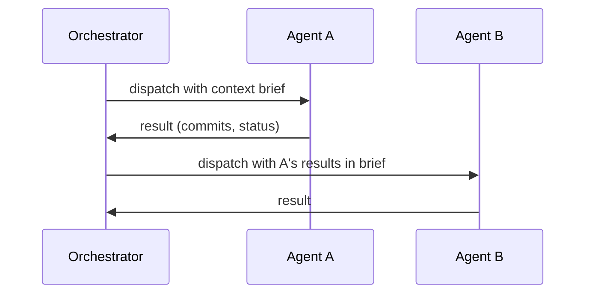
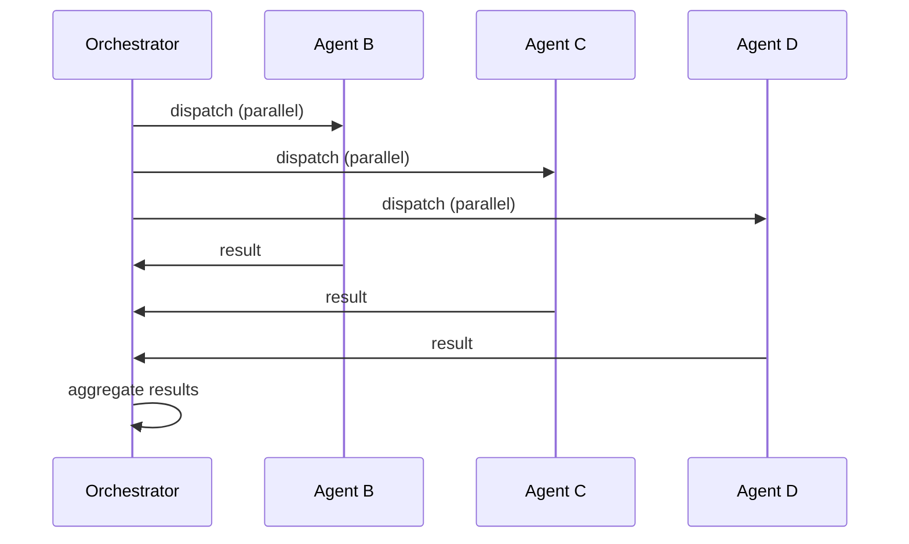
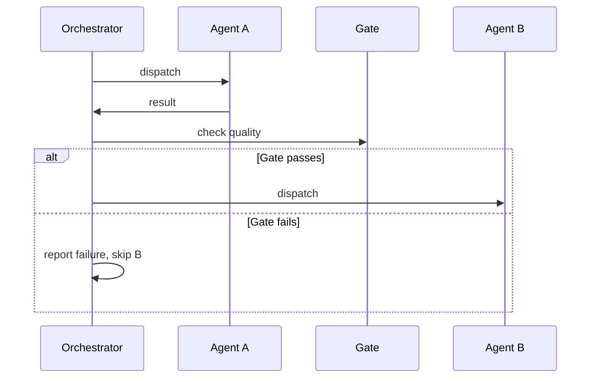

# Task Handoff Protocol

Defines how agents hand off work between each other in coordinated teams.

## Context Brief Format

When an agent hands off work to the next agent, it provides a context brief containing:

1. **PC Spec**: The pass condition being implemented (ID, type, description, command, expected)
2. **Files to Modify**: Which files the receiving agent should modify
3. **Prior PC Results**: Summary of completed PCs (max 5 lines each)
4. **Commit Rules**: Commit message templates for RED, GREEN, REFACTOR

The brief must be self-contained — the receiving agent has no access to the sender's conversation history.

## Handoff Triggers

| Trigger | Description | Example |
|---------|-------------|---------|
| Phase completion | Current agent's phase is done | TDD executor completes a PC |
| Quality gate pass | Gate check passes | Code review returns no CRITICAL findings |
| Task status change | tasks.md status changes to done/failed | PC status updated by orchestrator |

## Patterns

### Sequential (A -> B)

Agent B receives Agent A's results in its context brief. The orchestrator mediates all handoffs.

### Fan-Out (A -> [B, C, D])

All agents receive the same base context. Results are aggregated by the orchestrator after all complete. Failed agents do not block successful ones.

### Gated Handoff (A -> gate -> B)

Agent B only executes if the quality gate passes. The gate is typically a test suite run, clippy check, or code review pass.
